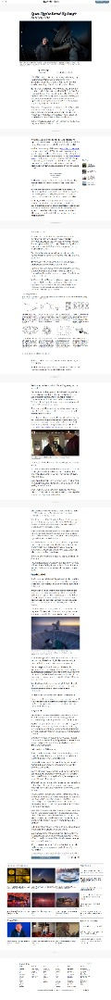

# New York Times Clone Page

This assignment consists of making a clone of a New York Times article page. By this point, the student should be familiar with the concepts of:

Embedding images
Working with forms (buttons in this case)
Floats and positioning
The box model

## Built With

- HTML/CSS,
- VISUAL STUDIO CODE

## Live Demo

[Live Demo Link](https://livedemo.com)

## Authors

👤 **Rafael Cavalheiro**

- Github: [@Rgcavalheiro](https://github.com/rgcavalheiro)
- Twitter: [@twitterhandle](https://twitter.com/rgcavalheiro)
- Linkedin: [linkedin](https://www.linkedin.com/in/rafael-cavalheiro-00415b94/)

👤 **Blaise Pascal Shyaka**

- Github: [@Blaise-Shyaka](https://github.com/Blaise-Shyaka)
- Twitter: [@blaiseshyaka95](https://twitter.com/blaiseshyaka95)
- Linkedin: [linkedin](https://www.linkedin.com/in/blaise-pascal-shyaka-b1340b111/)

## 🤝 Contributing

Contributions, issues and feature requests are welcome!

Feel free to check the [issues page](issues/).

## Show your support

Give a ⭐️ if you like this project!

## Acknowledgments

- Hat tip to anyone whose code was used
- Inspiration
- etc
